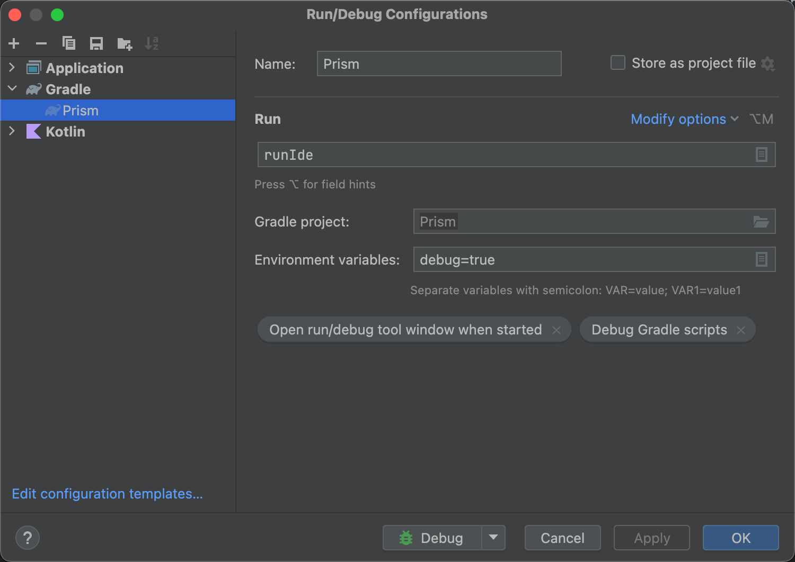

# Prism

## Introduction
Prism is an Android Studio plugin that maps line numbers between a device’s framework.jar and the corresponding Android source code.

This allows you to set breakpoints directly in Android framework source code with **any devices**, even when the source line numbers differ from those in the compiled framework on the device.

## How to Run

### Development Mode

- Update `localPath` in `build.gradle.kts` to point to your local Android Studio installation.
- Launch a sandbox Android Studio instance for test:
```
./gradlew runIde -Pdebug=true
```
- (Optional) Create a Run Configuration in IntelliJ/Android Studio for easier repeated testing:
<p align="left">  </p>

### Release mode

- To build the distributable plugin package:
```
./gradlew buildPlugin
```
The generated ZIP file will be located in: `build/distributions/`. You can install this ZIP directly in Android Studio via Settings → Plugins → Install Plugin from Disk.

## How to Use

- Install the Prism plugin in your Android Studio.
- Pull the framework file from your device:
```
adb pull /system/framework/framework.jar
```
- Configure the path to framework.jar in Settings → Other Settings → Prism.

You can now set breakpoints in framework source files and debug them with correct line mappings.

## Limitations

- Inner classes and anonymous classes are currently **not supported**.
- Line numbers may still not match due to the significant differences between framework.jar and the source code, so always ensure the Android source version matches your device’s system version as closely as possible. 